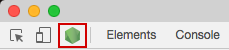
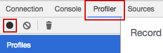
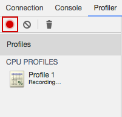
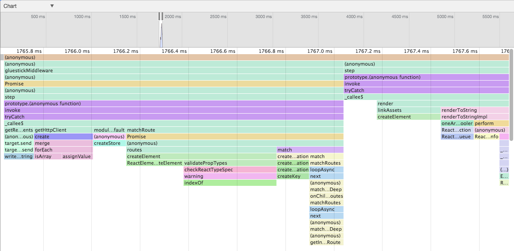

# Profiling GlueStick renderer

__Requirements: node 8.4.0+__

In order to start profiling gluestick renderer (aka server), you need to capture the profile information firstly. Do do so follow the following steps:

1. Run `gluestick start-client` command.

3. Run `gluestick start-server -D` command in separate terminal/tab.
    > `-D` flag is used to run the server in debug mode.

3. Open __Chrome Dev Tools__ (`cmd + alt + i` on MacOS)

4. Click __Node.js__ logo in top-left corner

    

5. Navigate to __Profiler tab__ and click __record button__

    

6. Open desired page served by GlueStick in a browser, for instance `http://localhost:8880`.

7. Stop recording after the page is loaded.

    

You should see the profile chart now.

Now you can see the trace and the time spent on each function call, so you can analyse, pinpoint the expensive functions and optimise them.

__Tip:__ By clicking on the function call in the chart, you will be redirected to it's source.

## Other resources

* https://stackoverflow.com/questions/1911015/how-do-i-debug-node-js-applications/16512303#16512303
* http://commandlinefanatic.com/cgi-bin/showarticle.cgi?article=art037
* http://blog.librato.com/posts/chrome-devtools